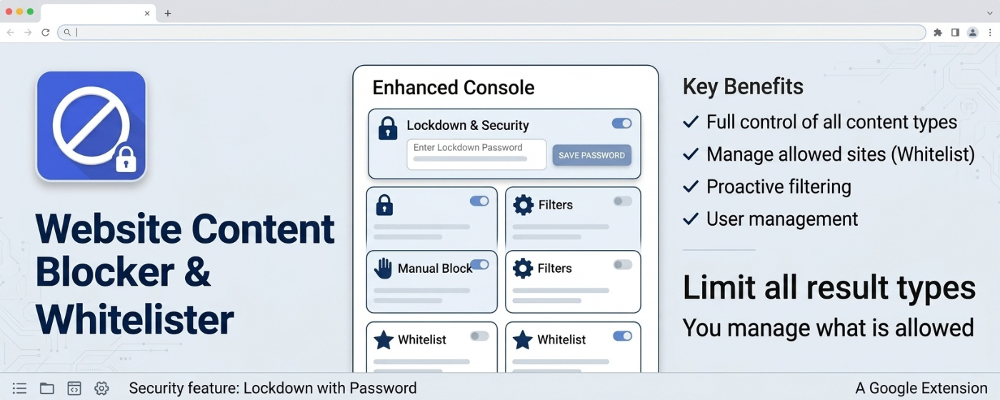

# Web Content Blocker

A Manifest V3 extension (Vite + React + TypeScript, pnpm) for Chrome and Brave that
keeps the web limited to what you choose to see.

- **Search result filtering** — hides results matching your blocked keywords and
  sites on **Brave Search** and **Google**, across every result tab: **All, Images,
  News, Videos, Maps, Goggles**. Every tab type is blocked by default; each has its
  own switch, plus a master on/off.
- **Site blocking** — opening a blocked site sends the tab to a calm landing page or
  an address of your choice.
- **Whitelist mode** — flip it on and *only* the sites you allow can be opened.
- **Password lock** — protects the popup and settings, and can guard the browser's
  extensions page so the blocker can't be switched off on impulse.
- **New tab page** — the same quiet landing page, with rotating sayings and shortcuts
  to your allowed sites.
- **Your own sayings and tab look** — upload sayings to replace the built-in
  proverbs, and set a custom tab title and icon.

Nothing leaves your browser — see [PRIVACY.md](PRIVACY.md).

## Build and load

```bash
pnpm install
pnpm build          # -> dist/
```

Then in Chrome or Brave:

1. `chrome://extensions` (or `brave://extensions`)
2. Turn on **Developer mode**
3. **Load unpacked** → select the `dist/` folder

While iterating:

```bash
pnpm watch          # rebuilds dist/ on save
```

After a rebuild, hit the reload arrow on the extension card, then reload the search
tab. Popup and background changes need the card reload; content-script changes need
both.

**You never need to Load unpacked a second time.** Doing so is what puts your rules at
risk, not rebuilding — see *Keeping your rules* below.

### Confirming a reload took effect

The version bumps whenever the code changes, in `package.json` and
`public/manifest.json` together. The new number appears on the extension card, and
the popup and settings page both show `v1.1.2 · built Aug 31, 14:32` — the timestamp
separating builds made within the same minute. If the number has not moved after a
reload, the card is still running the old code.

**Patch numbers run 0-19; the twentieth bump rolls into the next minor**, so
`1.0.19` is followed by `1.1.0`.

Two things trigger a bump, and neither double-counts:

- `pnpm build`
- the **Stop hook** in [`.claude/settings.json`](.claude/settings.json), which fires
  when Claude Code finishes a turn

Both run `scripts/bump-version.mjs --if-changed`, which compares a fingerprint of
`src/`, `public/`, `scripts/` and the root config files against
`.claude/.version-fingerprint`. It hashes file **contents**, not timestamps, so
regenerating the icons — byte-identical output — is correctly seen as no change. A
turn that edits and then builds therefore produces exactly one bump, and a turn that
changes nothing produces none.

`pnpm bump:force` bumps unconditionally; `pnpm build:noversion` rebuilds without
touching the version; `pnpm watch` never bumps, since it rebuilds on every save.

```bash
pnpm test           # matching + result-detection unit tests (vitest/jsdom)
pnpm typecheck
```

## Packaging for the Chrome Web Store

```bash
pnpm zip            # -> release/web-content-blocker-1.0.17.zip
```

[`scripts/pack.mjs`](scripts/pack.mjs) builds first, then archives the **contents** of
`dist/` — `manifest.json` has to sit at the root of the zip, and an archive holding
`dist/manifest.json` is rejected on upload. It excludes `.DS_Store` and any `.map`
file, deletes an existing archive of the same name rather than letting `zip` add to
it, and checks the layout with `unzip -l` before reporting the path.

The script is named `zip` rather than `pack` because `pnpm pack` is pnpm's own command
for building an npm tarball, and a built-in wins over a same-named script.

Because `pnpm build` bumps the version, the number in the filename always matches the
manifest inside. The Store refuses a re-upload at a version it already has, so each
submission needs a fresh build anyway. Running `node scripts/pack.mjs` directly skips
the build and fails if `dist/` has drifted from `package.json`.

Review asks you to justify each permission; the reasoning is in
[*The permissions this needs*](#the-permissions-this-needs) below, and the privacy
policy is [PRIVACY.md](PRIVACY.md). Publishing **Unlisted**
gets you an install link without the discovery-surface scrutiny of a public listing,
and can be flipped public later.

`chrome://extensions` → *Pack extension* produces a `.crx` instead, but Chrome has
blocked installing those from outside the Web Store on Windows and macOS for years.
For local use, **Load unpacked** on `dist/` is the better path.

## Opening a blocked site

Blocked sites are not only filtered out of search results — navigating to one is
intercepted too, using the same rules and the same wildcards. Three options on the
settings page:

- **Show a landing page** (default) — a quiet page with a rotating proverb.
- **Send me somewhere else** — any address you choose. A bare domain gets `https://`.
- **Do nothing** — filter search results only.

Two guards keep this from turning on you. **Search engines are never redirected**, so
a rule naming Brave or Google still just strips their results rather than hijacking
the search page and taking the blocker down with it. And if your chosen redirect URL
is itself blocked, the landing page is used instead of bouncing the tab between two
blocked addresses forever.

The landing page never names the site that was blocked — being told what you were
about to open is the reminder the page exists to avoid.

### Allowed sites only (whitelist)

Off by default. Switched on from the **Whitelist** toggle at the top of the settings
page, **every site not on the allowed
list is treated as blocked** and redirected as above. With the redirect set to **Do
nothing**, the landing page is used instead, since otherwise the whitelist would
have no effect.

- Entries use the blocked-sites syntax: `example.com` covers its subdomains, and `*`
  matches part of a host (`*.edu`).
- Search engines are **not** exempt here. Add `google.com` or `search.brave.com` if you
  still want to search.
- The blocked lists still apply on top. A site on both lists is blocked.
- An empty list with the whitelist on blocks every website. Extension pages and
  `chrome://` pages are never touched.
- Only top-level navigations are checked, not iframes or the resources a page loads.
  A site that signs you in on another domain (`accounts.google.com`, for one) needs
  that domain allowed too.
- The whitelist does not hide search results; it acts when you open a site.

Export and import include the allowed list (`allowedSites`). Importing fills the list
but never switches the whitelist on.

### Custom landing HTML

**Customise HTML** on the settings page replaces the built-in template. An element
with `id="wcb-quote"` is filled with a rotating proverb (twelve seconds each, shuffled
per visit); leave it out for a static page. `<style>` works. `<script>` does not run —
assigning markup this way never executes scripts, and the page's CSP blocks inline
handlers — so treat it as styling only. Markup is capped at 6000 characters to stay
inside `chrome.storage.sync`'s per-item limit.

The six built-in verses are from the English Standard Version, each credited
"(ESV)" (see [Scripture copyright](#scripture-copyright)). **Preview landing page**
opens it in a tab.

With the whitelist on, the landing page also lists the sites you can still go to:
in an element with `id="wcb-allowed"` if the markup has one, otherwise below it.
**Show allowed sites with whitelist mode off** lists them in custom HTML anyway, as
shortcuts, without blocking every other site.

To design the site cards yourself, add a `<template id="wcb-site">`. It is repeated
once per allowed site, in its own place, with these placeholders filled into text
and attributes:

| Placeholder | Becomes |
| --- | --- |
| `{{url}}` | `https://` address of the site. Empty for a wildcard rule, and an empty `href` is dropped so the link goes inert. |
| `{{site}}` | The allowed-list entry as written. |
| `{{image}}` | Your image for the site, set under **Site images** in the editor. Empty when none is set; an empty `src` is dropped and the stamped element gets `data-no-image`, so CSS can show a fallback. |
| `{{favicon}}` | The site's icon from the browser's favicon cache (a globe if it has never been visited). |
| `{{initial}}` | First letter of the site. |

```html
<ul class="sites">
  <template id="wcb-site">
    <li><a href="{{url}}"> {{site}}</a></li>
  </template>
</ul>
```

Each stamped element gets `data-site` (and `data-pattern` for wildcard rules) for
styling.

Site images are http(s) addresses, one per allowed site, kept in
`chrome.storage.local` (not synced, and not part of export/import) so they don't
count against the custom HTML's space. They load from any host: the whitelist only
checks pages you open, not the images a page shows. Each one does request the image
from its host whenever the landing page opens. **Open editor with live preview** opens a full-tab editor with insert
buttons for these snippets and a live preview beside it.

### Your own sayings

**Upload sayings** replaces the proverbs with your own list (up to 1000), kept in
`chrome.storage.local`. Two formats:

- **Plain text** — one saying per line, with an optional attribution after ` — `,
  ` -- ` or ` | `, e.g. `Stay the course — Grandpa`.
- **JSON** — an array of strings or of `{ "text", "ref" }` objects, bare or under a
  `"sayings"` key.

**Use proverbs** goes back to the built-in set.

### New tab page

The extension replaces the browser's new tab page with the landing page, minus the
"Not this way" heading, since you chose to come here. It shows the same rotating
sayings and, with the whitelist on, your allowed sites as shortcuts.

### Browser tab title and icon

**Browser tab** on the settings page sets a custom title and favicon for the landing
and new tab pages. Pick a preset icon (globe, document, spreadsheet, …) or upload an
image, which is scaled to 64 px and kept in `chrome.storage.local`. Both are off by
default.

### The permissions this needs

| Permission | Why |
| --- | --- |
| `storage` | Your rules, password hash, sayings and tab icon. |
| `webNavigation` | Sees top-level navigations so a blocked (or non-whitelisted) site can be redirected. It reads only the URL. |
| `tabs` | Reads tab URLs for the extensions-page guard (webNavigation never fires for `chrome://` pages) and finds search tabs for the popup and diagnostics. |
| `favicon` | Shows allowed sites' icons through `{{favicon}}` in a custom landing page, read from the browser's own icon cache, so no request leaves the browser. |

There is no broad host permission. The content script only runs on Brave Search and
Google, and the navigation listener gets URLs from `webNavigation` without needing
host access.

## Settings page

Rules live on a full settings page — right-click the toolbar icon → **Options**, or
open the popup and hit **Settings & diagnostics**. The popup carries the same
controls for quick edits; both write to the same storage and stay in sync while open.

The header holds two switches: **Blocking** (the master switch) and **Whitelist**.
Below them, three tabs:

- **Blocked** — search types, blocked keywords and blocked sites. Hidden while the
  whitelist is on. Those rules keep applying; the tab just steps aside.
- **Whitelisted** — the allowed-sites list.
- **Settings** — diagnostics, what opening a blocked site does, the password, and
  export / import.

The Settings tab opens with a **Diagnostics** panel that answers the questions you
cannot answer by looking at a search page:

- **Private windows** — whether the extension is actually allowed to run there,
  checked via `chrome.extension.isAllowedIncognitoAccess()`, with a button through to
  the extension's details page if it is not.
- **Runs on** — the host patterns the content script is registered for.
- **Search tabs open now** — every open tab the blocker should be running on, each
  marked *Private* or not, reporting the tab type and how many results it has hidden,
  or *not running — reload this tab* when no content script is present.

It also carries **Export / Import** for your rules — see *Keeping your rules* above.

### Private / Incognito windows

**Extensions do not run in private windows unless you allow it, per extension.**
Until you do, nothing is blocked there at all — no code change can work around it.

Turn on **Allow in Incognito** (Chrome) or **Allow in Private** (Brave) on the
extension's details page, then open a fresh private window. In Brave, *Private window
with Tor* is a separate mode with the same requirement.

A private search tab that does not appear under *Search tabs open now* is itself the
answer: the extension cannot see it, so it is not blocking in it.

### Password and the extensions-page guard

**Password** (Settings tab) locks the popup and the settings page behind a prompt.
Once entered it stays unlocked for 10 minutes, until **Lock now**, or until the
browser quits. It is stored as a salted PBKDF2 hash in `chrome.storage.local`, apart
from your synced rules, so it never syncs and export / import never touch it. A
forgotten password cannot be recovered.

**Guard the extensions page** (needs a password) sends any tab opening
`chrome://extensions` — or `brave://extensions` — to the password prompt, and on to
the page once it is entered. That closes the obvious way to switch the blocker off or
remove it. Watching those tabs is why the extension asks for the `tabs` permission.

An extension cannot fully stop its own removal. Right-clicking the toolbar icon →
**Remove from Chrome** still works, as do inspecting the popup with DevTools and
deleting the browser profile. To make the extension truly impossible to disable or
remove, force-install it by policy — `ExtensionInstallForcelist` (Windows Group Policy,
a macOS configuration profile, or `/etc/opt/chrome/policies/managed/` on Linux). A
force-installed extension has no Remove or disable switch at all. Add
`DeveloperToolsAvailability` = `2` as well to close the DevTools route.

## Rules

**Keywords** match against a result's title, snippet text and URL.

| Entry | Matches |
| --- | --- |
| `crypto` | any result containing "crypto", case-insensitive |
| `/\bnft\b/` | regex, delimited by slashes (`/pattern/flags`, default `i`) |

**Sites** match the hostname of any link inside a result. `example.com` also blocks
`news.example.com`. Paste a full URL and it is trimmed to the bare domain.

Use `*` to match part of a hostname:

| Entry | Matches | Does not match |
| --- | --- | --- |
| `example.com` | `example.com`, `news.example.com` | `notexample.com` |
| `porn*` | `pornhub.com`, `porntube.net` | `popcorn.com` |
| `*hub.com` | `videohub.com`, `hub.com` | `hub.com.evil.net` |
| `*sex*` | `sex.com`, `mysexysite.org` | `example.com` |

Patterns are anchored to the whole hostname, and dots stay literal, so `news.*` will
not match `newsexample.com`. A rule of nothing but wildcards is ignored rather than
blocking every result on the page.

Watch the substring form: `*sex*` also blocks `essex.gov.uk` and `sussex.ac.uk`.
Anchor one end (`sex*`) when you mean the start of the hostname.

**Sub pages and channels.** The *Blocked sub pages and channels* list, under
blocked sites, keeps the path, so a rule covers one part of a site rather than all
of it. *Allowed sub pages and channels* does the same for the whitelist. Both are
stored in the same list as their sites; an entry with a path is shown in the sub-pages
section.

| Entry | Matches | Does not match |
| --- | --- | --- |
| `youtube.com/@mkbhd` | `youtube.com/@mkbhd`, `…/@mkbhd/videos`, `m.youtube.com/@mkbhd` | `youtube.com`, `youtube.com/@mkbhdclips` |
| `youtube.com/watch?v=abc` | that video, with any other parameters | other videos |

Paths and query values are compared case-insensitively. Opening a covered page —
including in-app navigation on single-page sites like YouTube, caught through
`webNavigation.onHistoryStateUpdated` — is redirected like any blocked site, and a
search result linking under the path is hidden. A video's address does not name its
channel, so `youtube.com/@name` blocks the channel's pages, not its videos.

### Your lists stay out of sight

Both rule lists are **collapsed by default, every time you open the popup or the
settings page**. You see a count — "14 keywords hidden" — and nothing else. Reading
back what you blocked is its own reminder of the thing you were avoiding, so the open
state is deliberately not remembered.

Adding never requires opening the list: the input stays available, and after a submit
you get "Added 1 keyword" or "Already on the list — nothing added" rather than an
echo of what you typed. **Show list** reveals the entries when you genuinely need to
remove one.

Rules apply live — no page reload needed. They are stored in `chrome.storage.sync`,
so they follow your profile within one browser (Chrome and Brave are separate
profiles, so each needs its own list).

### Keeping your rules

**Rebuilding and reloading the extension does not touch your rules.** `pnpm build`
replaces the contents of `dist/`, and the reload arrow on the extension card re-reads
them, but storage belongs to the extension's identity rather than to its files. For an
unpacked extension that identity is derived from the folder you loaded, so as long as
that path stays put, every rebuild keeps your keywords and sites.

[`scripts/clean.mjs`](scripts/clean.mjs) empties `dist/` in place rather than deleting
the directory, so the folder Chrome is watching never disappears mid-build.

What *does* lose them is anything that changes that identity: removing the extension
and adding it back from a different folder, or moving the project. Two ways to be
safe:

- **Export** from the settings page before doing any of that, and **Import** after.
  Importing merges — it only ever adds rules, never removes.
- To pin the identity permanently, add a `"key"` field (a base64 SPKI public key) to
  `public/manifest.json`. The extension ID then follows the key rather than the path.
  Note that adding it *changes* the ID once, so export your rules first.

## What a blocked result looks like

Nothing. A blocked result is hidden outright, with no stub, no marker and no way to
reveal it from the page — the results around it close up as if it was never there.

Results are held back until the first scan finishes, so a blocked result is never
painted and then yanked away. Only the results area is gated, never the page, and a
1.5 second failsafe releases it no matter what — nothing can leave the page hidden.

On image tabs a second pass runs behind the selectors. When an image matches, the
image alone is **not** what gets hidden — that would leave its caption and source
link stranded in the grid. [`findTile`](src/content/collect.ts) climbs from the image
to the element holding the whole tile and removes that instead, stopping at the first
ancestor that reaches a second thumbnail or spans too many hosts, since that one is
the grid rather than the tile.

Only where no tile can be isolated at all does the image get **blanked in place**:
`src` replaced with a white pixel, painted a flat white block of the original size.
The pixels are dropped at the source rather than covered up, and the original URL is
kept in a JS map rather than a data attribute, so nothing in the markup can bring it
back. That path also re-checks images it has already blanked, because image grids
lazy-load by re-pointing `src` on existing nodes.

The only signal is the toolbar badge, which counts how many results are hidden on
the current tab. To see what was caught, turn a rule off in the popup, or use
`__wcb` in the console (below).

## How results are detected

Search engines rewrite their markup constantly, so [`src/engines.ts`](src/engines.ts)
holds a deliberately redundant selector list per engine and tab type. A stale
selector costs nothing; one surviving selector keeps blocking alive.

Not every result is a link. Brave renders each image result as a `<button>` with the
thumbnail, caption and source name inside it and no anchor anywhere, so those tiles
are matched by `button.image-result` and `[data-index]`, and a result carrying no
links at all falls back to reading domains out of its visible text.

The image preview has its own strip of recommended images — `button.images-grid-image`
elements — and it mounts outside the results container, which is why image tabs set
`scanWholePage` and collect candidates from the whole document rather than `#results`.

Those thumbnails are the hard case: bare images with no caption, no link and nothing
to match a rule against. Two things address them.

**Repeats are recognised by the picture itself.** Every image inside a blocked result
is remembered by URL, plus its trailing path segment when that is long enough to be a
content hash — engines proxy the same picture at several sizes through URLs that
differ only in their size parameters. The same image reappearing anywhere on the page
is then blocked on sight, caption or not.

**The rest of the strip is removed outright**, controlled by *Hide recommended images
in the preview* (on by default). A thumbnail that does not repeat a blocked result
cannot be judged at all, and the strip exists only to offer more pictures.

This is the one thing that hides an element without a rule matching it, so it is
scoped tightly. Brave uses the **same component class for the grid and the preview's
suggestions**, and the only thing separating them is position: anything inside the
results container is a real result and is never touched by this — it stays visible and
clickable, removable only by an actual rule match. Beyond that, the strip's container
is collapsed only when it holds the thumbnails and at most one other child; otherwise
each thumbnail goes individually, so the preview itself cannot disappear.

[`src/content/collect.ts`](src/content/collect.ts) then narrows those matches to
individual results: elements holding two or more other candidates are treated as
containers and dropped in favour of their children, nested duplicates collapse to
the outermost survivor, and anything linking to more than five distinct hosts is
skipped entirely. That last guard means a loose selector under-blocks rather than
wiping out a whole results grid.

### Tuning selectors

If a result type stops being caught, open DevTools on the results page, switch the
console context dropdown from `top` to **Web Content Blocker**, and inspect:

```js
__wcb.state         // engine, tab type, whether blocking is active, live counts
__wcb.candidates()  // every element treated as one result, with the facts matched
__wcb.rescan()      // re-evaluate the page from scratch
```

If `candidates()` is empty or returns the whole results container, add a selector to
the relevant list in `src/engines.ts`.

## Layout

```
public/manifest.json     MV3 manifest (also public/icons, generated at build time)
src/engines.ts           per-engine URL detection + result selectors
src/matcher.ts           keyword/regex/site rule compilation and matching
src/storage.ts           chrome.storage.sync wrapper with defaults + change events
src/content/             content script: scan, block, observe, report
src/**/*.test.ts         unit tests for the matching and detection heuristics
src/ui/                  controls shared by both pages + the settings hook
src/ui.css               shared design tokens and control styles
src/popup/               compact popup (index.html)
src/options/             full settings page + diagnostics (options.html)
src/blocked/             landing page shown instead of a blocked site (blocked.html)
newtab.html              new tab override, reusing src/blocked/ as a home page
src/landing.ts           default template + the proverbs it rotates
src/sayings.ts           parsing and storage for uploaded sayings
src/tabIcon.ts           custom tab title and favicon (+ tabIconPresets.ts)
src/lock.ts              password hash, unlock window, extensions-page check
src/redirect.ts          where a blocked navigation is sent, and when not to
src/background.ts        service worker: badge counts, redirects, extensions guard
scripts/generate-icons.mjs  renders the toolbar PNGs, no image dependencies
```

Two Vite builds produce `dist/`: [`vite.config.ts`](vite.config.ts) for the popup,
settings page and service worker (ES modules, with React shared in one chunk across
both pages), and [`vite.content.config.ts`](vite.content.config.ts) for the content
script, which MV3 requires to be a single non-module IIFE.

## Adding another engine or domain

Google is matched on `https://*.google.com/*` only. For a country domain
(`google.co.uk`, …) add it to `content_scripts.matches` in
`public/manifest.json`; the engine's own `matches` test already accepts any
`google.*` host. A different search engine is a new entry in `ENGINES`.

## Known limits

- Maps results on both engines live inside an embedded map UI; blocking there is
  best-effort and works on the list rail, not on map pins.
- Google has no Goggles tab, so that switch only affects Brave.
- `chrome.storage.sync` caps an item at ~8 KB — a few hundred rules.

## Scripture copyright

Scripture quotations are from the ESV® Bible (The Holy Bible, English Standard
Version®), © 2001 by Crossway, a publishing ministry of Good News Publishers. Used by
permission. All rights reserved.
